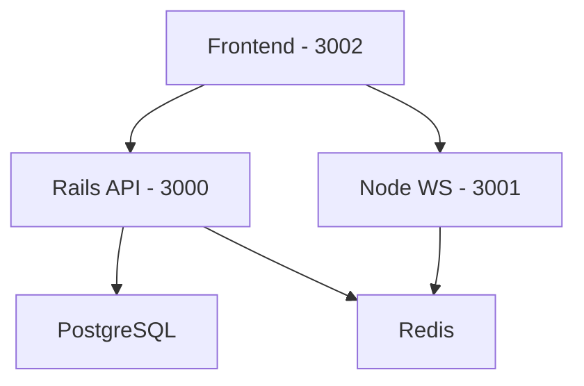

# Real-Time Sports Betting System

A scalable, real-time sports betting platform built with Ruby on Rails, Node.js, and React.

## Table of Contents

- [Overview](#overview)
- [Features](#features)
- [Prerequisites](#prerequisites)
- [Quick Start](#quick-start)
- [Architecture](#architecture)
- [Development](#development)
- [Testing](#testing)
- [Data Simulation](#data-simulation)
- [API Documentation](#api-documentation)
- [Monitoring](#monitoring)
- [Troubleshooting](#troubleshooting)

## Overview

<details>
<summary>Click to expand</summary>

A microservices-based sports betting system featuring:
- Real-time odds updates and bet placement
- User balance management and bet history
- Fraud detection and prevention
- Live leaderboard updates
- Mock data generation for testing

### Key Components

- **Rails API**: Core backend for business logic
- **Node.js**: Real-time updates via WebSocket
- **React**: Modern, responsive frontend
- **Redis**: Pub/sub and caching
- **PostgreSQL**: Data persistence

</details>

## Features

<details>
<summary>Click to expand</summary>

### Core Features
- User registration and authentication
- Real-time bet placement and odds updates
- Live game status tracking
- User balance management
- Betting history and statistics

### Advanced Features
- Fraud detection system
- Real-time leaderboard
- WebSocket-based updates
- Transaction safety with database locks
- Comprehensive test coverage

</details>

## Prerequisites

<details>
<summary>Click to expand</summary>

- Docker and Docker Compose
- Make (for using Makefile commands)
- Git

Optional for local development:
- Ruby 3.2.2
- Node.js 18+
- PostgreSQL 14
- Redis 7

</details>

## Quick Start

<details>
<summary>Click to expand</summary>

1. Clone the repository:
\`\`\`bash
git clone <repository-url>
cd real-time-sports-betting-system
\`\`\`

2. Initial setup:
\`\`\`bash
make setup
\`\`\`

3. Start the system:
\`\`\`bash
make start
\`\`\`

4. Generate sample data:
\`\`\`bash
make generate-data
\`\`\`

5. Access the services:
- Frontend: http://localhost:3002
- API Documentation: http://localhost:3000/api-docs
- WebSocket Server: ws://localhost:3001

</details>

## Architecture

<details>
<summary>Click to expand</summary>

### System Architecture



### Data Flow
1. User places bet via frontend
2. Rails API validates and processes bet
3. WebSocket server notifies all clients
4. Leaderboard updates in real-time

</details>

## Development

<details>
<summary>Click to expand</summary>

### Available Make Commands

```bash
make help                 # Show all available commands
make start               # Start all containers
make stop                # Stop all containers
make restart             # Restart all containers
make logs                # View logs
make shell-rails         # Access Rails console
make shell-node          # Access Node console
```

### Container Structure

- **rails**: API and business logic
- **node**: WebSocket server
- **frontend**: React application
- **db**: PostgreSQL database
- **redis**: Caching and pub/sub

### Environment Variables

- `RAILS_ENV`: Rails environment
- `NODE_ENV`: Node.js environment
- `REDIS_URL`: Redis connection URL
- `DATABASE_URL`: PostgreSQL connection URL

</details>

## Testing

<details>
<summary>Click to expand</summary>

### Running Tests

```bash
# Run all tests
make test

# Run specific test suites
make test-rails
make test-frontend

# Run with specific environment
RAILS_ENV=test make test-rails
```

### Test Structure

- **Rails**: RSpec for unit and integration tests
- **Frontend**: Jest for component and integration tests
- **WebSocket**: Integration tests with mock clients

</details>

## Data Simulation

<details>
<summary>Click to expand</summary>

### Generating Mock Data

```bash
# Generate initial mock data
make generate-data

# Simulate real-time changes
make simulate-changes
```

### Data Generation Includes

- Sample users with balances
- Active and upcoming games
- Historical bets and results
- Leaderboard data

### Real-time Simulation

The system can simulate:
- Odds changes
- Game status updates
- New bets placement
- Balance updates

</details>

## API Documentation

<details>
<summary>Click to expand</summary>

### Authentication

```ruby
# Headers required for authenticated endpoints
Authorization: Bearer <jwt_token>
Content-Type: application/json
```

### Key Endpoints

- `POST /api/v1/users`: Create new user
- `POST /api/v1/bets`: Place new bet
- `GET /api/v1/users/:id/bets`: Get user bet history
- `GET /api/v1/leaderboard`: Get current leaderboard

</details>

## Monitoring

<details>
<summary>Click to expand</summary>

### Health Checks

- Database: `localhost:5432/health`
- Redis: `localhost:6379/ping`
- Rails: `localhost:3000/health`
- Node: `localhost:3001/health`

### Logs

```bash
# View all logs
make logs

# View specific service logs
docker compose logs rails
docker compose logs node
```

</details>

## Troubleshooting

<details>
<summary>Click to expand</summary>

### Common Issues

1. **Database Connection Issues**
   ```bash
   make db-reset  # Reset and recreate database
   ```

2. **Redis Connection Issues**
   ```bash
   make restart   # Restart all services
   ```

3. **Container Issues**
   ```bash
   make clean    # Remove all containers and volumes
   make setup    # Fresh setup
   ```

### Debug Mode

Set `DEBUG=true` for additional logging:
```bash
DEBUG=true make start
```

</details>
