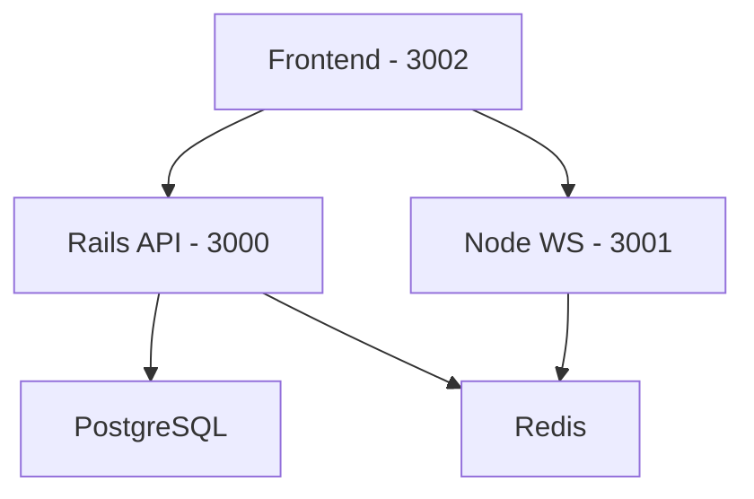

# Real-Time Sports Betting System Analysis

## Repository Structure

```tree
├── README.md
├── docker-compose.yml
├── frontend/
│   ├── Dockerfile
│   ├── package.json
│   └── src/
│       ├── App.tsx
│       ├── components/
│       ├── contexts/
│       ├── pages/
│       ├── services/
│       └── types/
├── node/
│   ├── Dockerfile
│   ├── package.json
│   └── server.js
└── rails/
    └── sport_betting/
        ├── Gemfile
        ├── app/
        │   ├── controllers/
        │   ├── models/
        │   └── services/
        ├── config/
        └── spec/
```

## Architecture Overview

This is a microservices-based real-time sports betting system with three main components:

1. **Frontend (Port 3002)**
   - React-based TypeScript application
   - Real-time updates via WebSocket
   - Key dependencies:
     - React 18.2.0
     - TypeScript 4.x
     - WebSocket for real-time communication
     - React Router for navigation

2. **Node.js Service (Port 3001)**
   - WebSocket server for real-time updates
   - Handles betting events and live game updates
   - Integrates with Redis for pub/sub

3. **Rails API (Port 3000)**
   - Ruby on Rails 7.1.5
   - PostgreSQL database
   - Key features:
     - User authentication (Devise)
     - Background job processing (Sidekiq)
     - API documentation (RSwag)
     - Fraud detection service

## Infrastructure

### Docker Composition

- **Database**: PostgreSQL with persistent volume
- **Cache**: Redis for real-time events and Sidekiq
- **Services**:
  - Rails API container with hot reload
  - Node.js WebSocket server
  - React frontend development server

### Database Structure

- User model with Devise integration
- Games table for sports events
- Bets table tracking user wagers
- Balance tracking for users

### API Routes

```ruby
namespace :api do
  namespace :v1 do
    resources :users, only: [:create] do
      member do
        get :bets  # User bet history
      end
    end
    resources :bets, only: [:create]  # Place new bets
  end
end
```

## Key Features

1. **Real-Time Betting**
   - WebSocket integration for live updates
   - Real-time balance updates
   - Live game status changes

2. **User Management**
   - User registration and authentication
   - Balance tracking
   - Bet history

3. **Fraud Prevention**
   - Dedicated FraudDetectionService
   - Real-time transaction monitoring

4. **Testing**
   - RSpec for Rails API testing
   - Factory Bot for test data
   - Controller specs for API endpoints

## Development Setup

Services run on different ports:

- Frontend: <http://localhost:3002>
- Rails API: <http://localhost:3000>
- WebSocket Server: <http://localhost:3001>
- PostgreSQL: localhost:5432
- Redis: localhost:6379

### Container Dependencies



## Technical Stack

1. **Frontend**
   - React 18
   - TypeScript
   - WebSocket client
   - React Router DOM

2. **Backend (Rails)**
   - Rails 7.1.5
   - PostgreSQL
   - Devise for auth
   - Sidekiq for background jobs
   - RSwag for API docs

3. **Real-time Service (Node)**
   - Node.js
   - WebSocket server
   - Redis integration

4. **Infrastructure**
   - Docker Compose
   - Volume persistence for DB
   - Hot reload enabled
   - Development optimized
